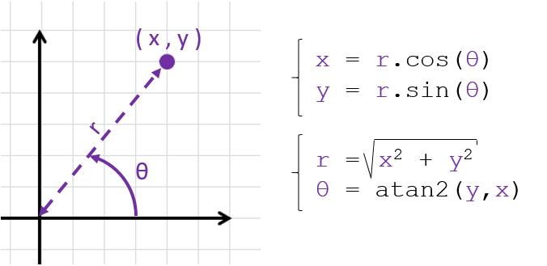
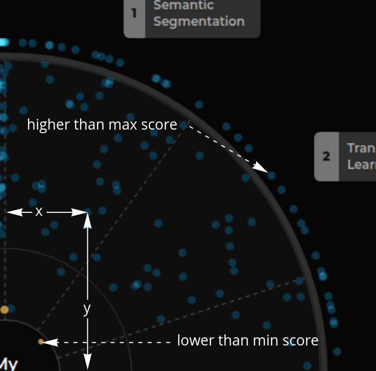
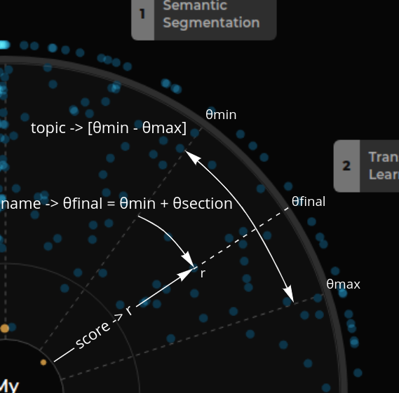
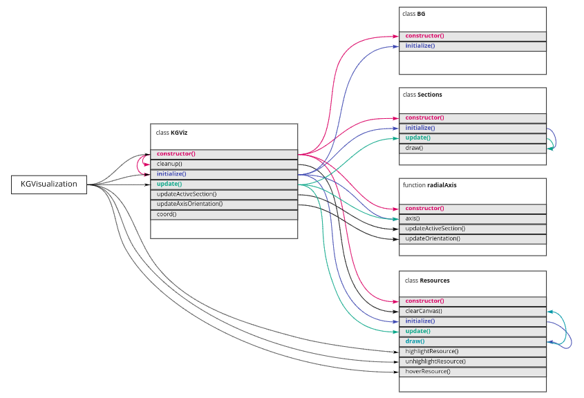

# KGViz component

Before talking about this component, we should review how the polar coordinates work and how data
is formatted.

## Polar coordinate visualizations

When working with visualizations, we typically work in a 2-dimensional space, these dimensions trend to be cartesian 
(x and y) so we do not need to care about transformations. In circular charts like this one, the coordinate system
use polar coordinates (r and θ) and we need to apply some maths to transform from cartesian to polar coordinates.

We need to make these transformations because the screen uses cartesian coordinates (x - width, y - height) but
data is encoder in a polar way (r - score, θ - topic/section).

## Data processing

For each resource we need to get the following information:
- x coordinate
- y coordinate
- is the resource score lower than the minimum displayed score?
- is the resource score higher than the maximum displayed score?

> Note that we also need other information such as the paper id of whether if it is starred
> or not, but this information is included directly in the data, so we do not need to make
> additional calculations.

### Calculating `x` and `y`

We have a function (`coord`) that returns those values. To get these values we need to make some
considerations:
- `score` will be used to get the `r` value.
- `category` (topic) and `name` will be used to get the `θ` value. With `category` we get the section
  in where the resource will be placed, within the section we get the final `θ` by applyng a hash to the
  resource name so each paper will be located at the same position with different renders.

> Angle: With the topic we know the section to locate the resource and a section has a min θ and a max θ
> (for instance, a section could be located between 20° and 45°). We cannot select a random number within
> the range because refreshing the page would cause this number to change and that could be confusing. By
> applying a hash to the resource name and obtaining a number within the range (for instance, 32.6°) based
> on that hash, we can be sure this number will be always be the same for a specific resource name.

the `coord` function makes all these calculations and provide some configuration:
- `jittered`: add the hash logic to get the final angle based on the resource name.
- `bisector`: the final angle will be in the middle of the section [`θmin + (θmax - θmin) / 2`].
- `offset`: applies son offset (in pixels) to the radius.

### Formatting the data

Finally, we can format the data, so it can be consumed by the chart.

There are three different scenarios we can find:
1. **resource within the score range**: no special considerations has to be taken into account here.
2. **resources with less score than the minimum**: `outsideMin` flag will be set to true and radius will be the maximum
   one with some positive offset.
3. **resources with more score than the maximum**: `outsideMax` flag will be set to true and radius will be the minimum
   one with some negative offset. Note that these resources will be displayed at a smaller scale than the rest.

## Interaction between children

`KGViz` is composed by 4 children elements: `BG`, `Sections`, `Resources` and `radialAxis`. This component is the base
one and, as you can see in the image, propagates the lifecycle stages to the remaining elements.

## Radial axis

You can see information about this component [here](./radialAxisLogic.md).
