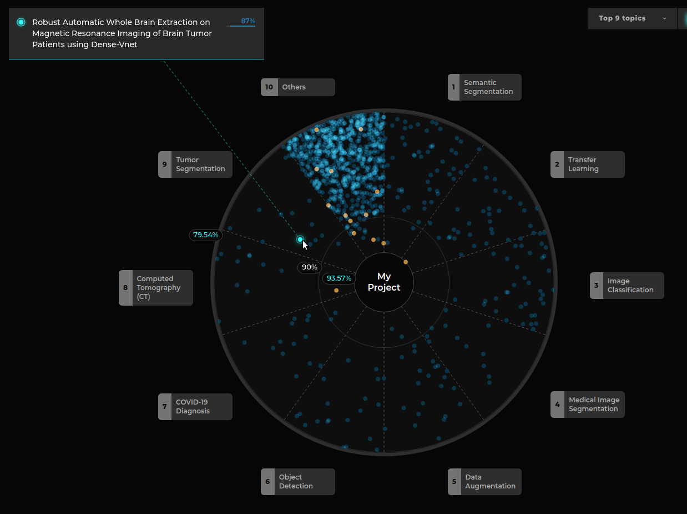
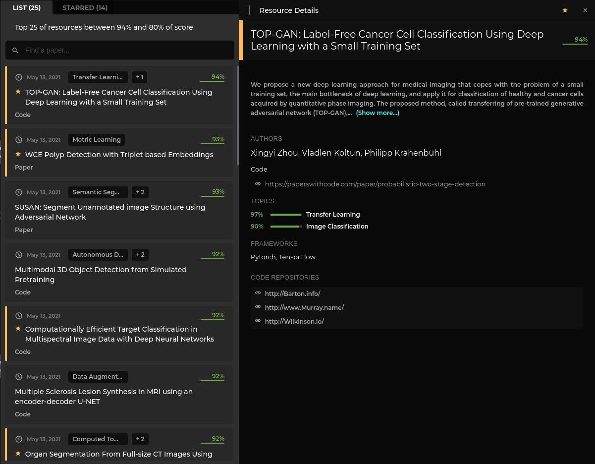
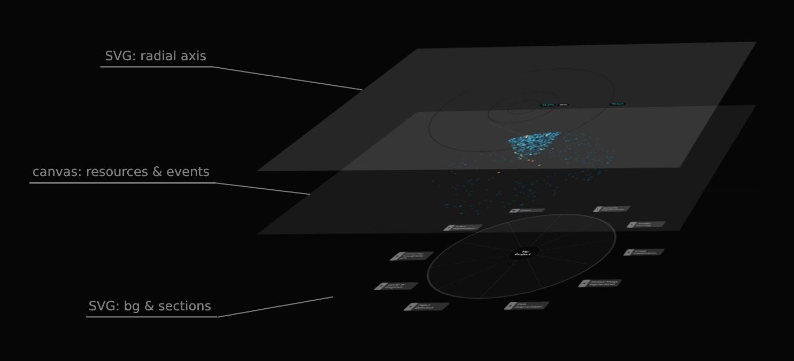

# Knowledge Galaxy

The Knowledge Galaxy is composed by three different pieces:

### Filters

Currently, there is only one filter (topic filter) but there will be more soon.


More information about filters [here](./filters.md).


### Visualization

The core of the module, includes the radar chart itself, and the tooltip located in the top left corner.



More information about the visualization [here](./Visualization.md).

### Panels

Displays a short list with the starred and most relevant resources. There is a panel (the one located at the right) that shows details of a specific resource.

> Note that these panels have two versions: 
>  - Visualization-linked panels (accessible from the KG section)
>  - starred resources (accessible from anywhere within a project)



## Score

We use the concept of "score" to indicate quality or relevance:

- **Project description score:** [0%-100%] how good is the description, higher values tells
  the user that better results will be provided.
- **Resource score:** [0%-100%] how good is a recommendation (confidence), higher values tells 
  the user that the resource is more related with the project.
- **Topic relevance:** [0-Inf] how good is the relation between a topic and a project. Higher 
  values tells the user that its project could be categorized with this topic.

## Data

The data received from the API has this shape:

```graphql
type KnowledgeGraphItem {
  id: ID!
  category: KnowledgeGraphItemCat! # Paper | Code
  title: String!
  abstract: String!
  authors: [String!]!
  score: Float!
  date: String!
  url: String! # Source url
  topics: [Topic!]! # Topic -> { name: String!, relevance: Flota! }
  starred: Boolean!

  # optional fields
  repoUrls: [String!] # If category is Code, code repositories
  externalId: ID # for example: arxivId. Not used by now.
  frameworks: [String!] # TensorFlow, Pytorch...
}
```

But we make a transformation to work with it within our component

```graphql
type KGItem {
  ...KnowledgeGraphItem,
  topic: Topic!
}
```

### The value of `topic`

We can receive hundreds of topics, but we will show up to 9 different 
topics (the most relevant ones).

Each resource may have more than one topic, if that is the case, we will 
assign the most relevant topic to that resource.

In case the resource has no topics or its most relevant topic is not included
in the top 9 topics, we assign to that resource the topic 'Others' instead 
(with 0 relevance).

## Mixed mode rendering layers


