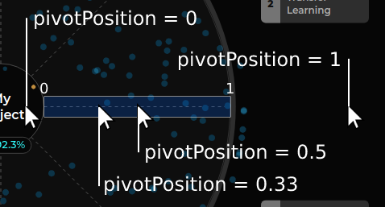
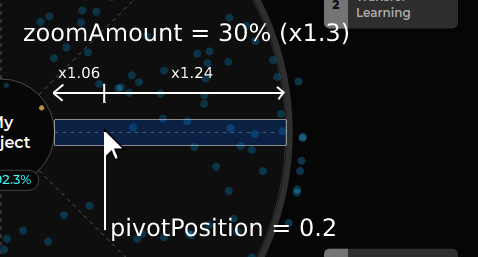
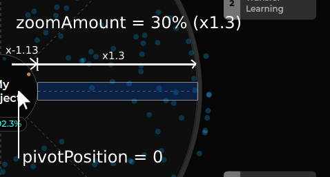
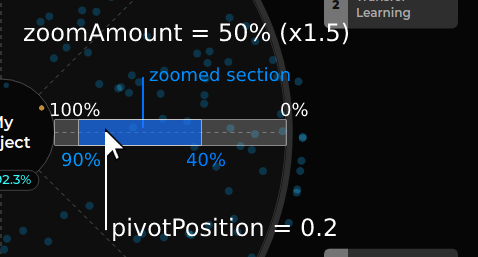

# Knowledge Galaxy Filters

There are two filters that can be applied to the Knowledge Galaxy

## Topic Filter

You can select the topics you want to see (from the top 9 topics) and whether to 
show or hide the resources from other topics.

## Score Filter

One of the most complex logic to understand is how the score is managed in
order to allow the exploration of the visualization.

All this logic is wrapped inside the hook `useKGVizScores`.

There are two concepts to know: `scores` and `borderScores`:
- `scores` - the scores displayed in the radar chart.
- `borderScores` - the maximum and minimum score values `scores` can take. Now is set to the maximum
  score of all the resources and 0.

> Note that even if the representation of the score is percentual (0-100%), we
> use a floating number (1.0-0.0) and reverse the values (max-min) to handle the logic.

### Initial animation

When mounting the visualization, an animation is displayed, showing all the score range (1-0),
and zooming in into the scores that the data uses.

To do that, we use an `animating` flag that tell us whether the animation has been done or not.
When receiving data, if the animation has not been done, we use a d3 transition (we use this instead
of a spring or pure js animation as these animations are more performant and easier to handle) to move
from the initial score values (1-0) to the final ones (ex. 0.96-0.72).

> Note: during the animation process, scroll zoom is disabled.

### Updating when data changes

When there is an update in the data (filtered sections changed, new data is received...), `scores` is
fixed to the maximum and minimum values that the data uses and borderScores is updated.

### Zooming

When zooming, we receive a zoom amount in pixels (the weight of the scroll) and the position of the mouse
within the radar chart (0 if the mouse is located in the inner circle, 1 if the mouse is located outside the radar,
0.5 if the mouse is located at the center of the score scale, etc...)

Note that the zoom amount is normalized. Instead of using the pixels, we define a step size on 100px, then
we define a zoom amount per step (12.5%) and apply the zoom amount multiplied by the number of steps. This normalization
is important as we can receive zoom amounts in pixels that can vary a lot (for instance, from 20px to 700px).

To maintain the pivot point when zooming, zoom is applied proportionally to each of the sides divided by the pivot
point. For instance, if the pivot point is located at 0.2 and making a zoom of 30%, 2/10 of that zoom will be applied 
to the left side and 8/10 to the right side. This way, if there is a resource at the pivot position, the resource will
be located at the same spot after applying the zoom.

When the mouse is outside the inner range, we apply 100% of the zoom amount to the opposite score and
-10% of the zoom amount to the closest score (that way you can play with the resources located outside
the inner range).

Scrolling up narrows whe score window (zoom in) and scrolling down makes it bigger.

If scores are 100% and 0%, and we zoom in, new scores could be 90% and 10%.

### Dragging

The concept of dragging is quite simple, the scores difference is maintained and both scores are shifted the same amount.

When dragging starts, we store the initial scores values (pivotScores), and those values will remain the same until
dragging ends. There is a variable (`dragAmount`) that keeps track of the amount of dragging done. This amount is the
number of pixels that the scores shift.

Dragging is blocked when trying to bypass the border scores.
