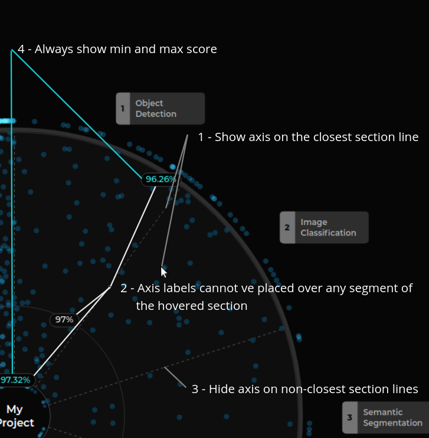
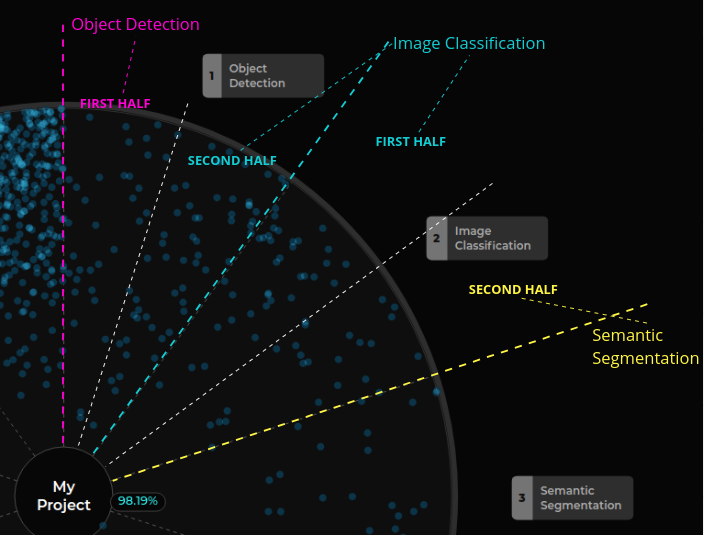
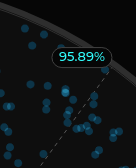
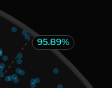
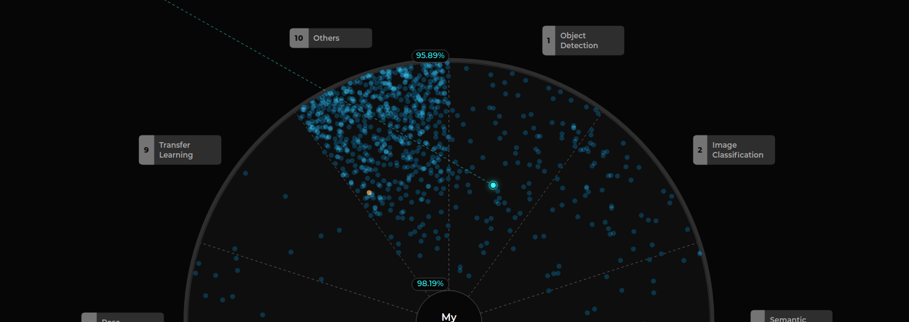
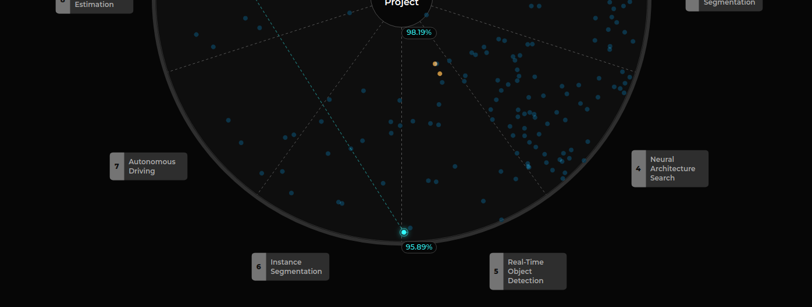
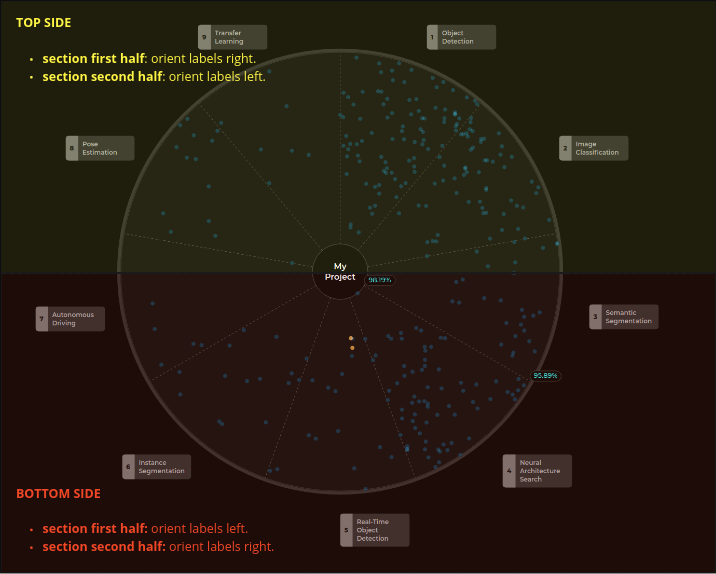
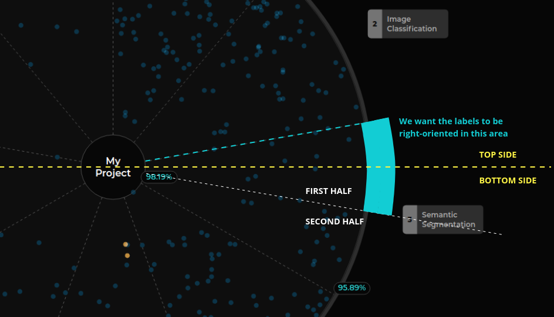
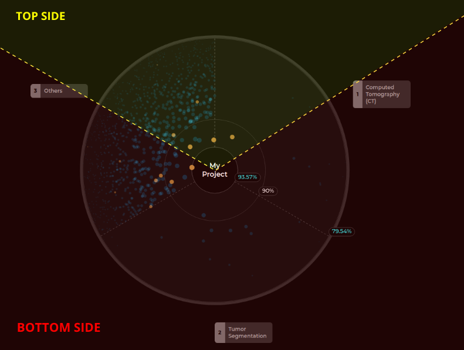

# Radial axis logic

The logic to apply in order to make the radial axis to work is quite complex. In this documentation file we
will review the logic behind that.

## Requirements

We need to meet the following requirements:
1. **Show axis on the closest section line:** with respect to the mouse position.
2. **Axis labels cannot be placed over any segment of the hovered section:**  we do not want the axis to 
   make the exploration harder.
3. **Hide axis on non-closest section lines:** showing those axes will make the visualization messier.
4. **Always show min and max scores:** as those values add context to the visualization and are relevant.

## Implementation

### Getting the closest section line

This is the easiest thing to do. You need to know the angle the mouse is located at and whether if you are in the
first half of a section ot the second half:
- **first half:** active section is the actual one.
- **second half:** active section is the next one (unless you are in the last section, in this case this would be
  the first section).

> Note: Remember that sections representation are the lines that split each slice.

### Orienting the labels

Axis can have two orientations: left and right:

Right oriented

Left oriented

Depending on the situation we need to set one or another. This is the hard part, there are several considerations to take into account:
- **Quadrant:** depending on the quadrant this behavior might change.
- **Section size:** if the section is too big you need to take care about the halves, and the quadrants as a
  section can be located in two quadrants at the same time.

#### Orientation on top and bottom sides of the chart

If you are on the first half of a section, if the section is located at the top side of the chart, the axis
labels will be right-oriented.

If you are on the first half of a section, if the section is located at the bottom side of the chart, the axis
labels will be left-oriented.

Same applies with the second half of a section but with opposite orientations.

The following image shows a representation of this concept.

#### The section between sides problem

The previous approach works for most cases, but if a section has one half that is located in both sides of the chart,
we need to make some adjustments, as we do not want the orientation of the labels to change when moving within the same
half of a section:

To fix this, we shift the bottom side threshold to match with the closest section
bisector when this issue appears.

