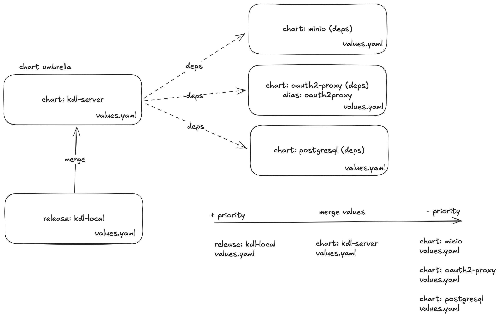

# kdl-server value precedence order



When deploying KDL Server using `helmfile` the values are merged in the following order (from highest to lowest precedence):

1. Values from Helmfile's templated files:

   ```yaml
   values:
   - "values/{{ .Release.Name }}/values.yaml.gotmpl"
   - "values/{{ .Release.Name }}/values.yaml"
   ```

2. Values defined in KDL Server Helm chart `values.yaml`
3. Default values from dependencies

## Examples

### Example with MinIO

```yaml
# kdl-local/values.yaml
minio:
  auth:
    rootUser: "custom-user"
    rootPassword: "custom-password"
```

Overrides:

```yaml
# kdl-server Helm chart values.yaml
minio:
  auth:
    rootUser: "ChangeMe"
    rootPassword: "ChangeMe"
```

### Example with Keycloak

```yaml
# kdl-local/values.yaml
keycloak:
  ingress:
    enabled: true
    className: "nginx"
```

Overrides:

```yaml
# kdl-server Helm chart values.yaml
keycloak:
  ingress:
    enabled: false
```

## Important considerations

1. Dependency aliases

   * Some dependencies use aliases (example: `oauth2-proxy` -> `oauth2proxy`)
   * When overriding values, use the alias name:

     ```yaml
     # Use alias, not oauth2-proxy
     oauth2proxy:
       config:
         configFile: |-
           email_domains = [ "*" ]
           ...
     ```

2. Conditional dependencies

   * All dependencies have conditions:

     ```yaml
     condition: keycloak.enabled
     condition: minio.enabled
     condition: mongodb.enabled
     condition: oauth2proxy.enabled
     condition: postgresql.enabled
     ```

   * Enable/disable in your values:

     ```yaml
     keycloak:
       enabled: true
     minio:
       enabled: false
     ```

3. Helmfile specific features

   * Uses templating with `.gotmpl` files
   * Supports needs/dependencies between releases

   ```yaml
   needs:
   - kdl/mongodb-string-uri
   - kdl/initial-resources
   ```

## Examples of value overrides

1. Global values

   ```yaml
   # values/kdl-local/values.yaml
   global:
     imageRegistry: "custom.registry.io"
     domain: "kdl.local"
     ingress:
       tls:
         enabled: true
   ```

2. Component values

   ```yaml
   # kdl-local/values.yaml
   postgresql:
     auth:
       username: "kdl"
       password: "secretpassword"
       database: "kdl"
     primary:
       persistence:
         enabled: true
         size: "10Gi"

   mongodb:
     enabled: true
     auth:
       rootUser: "admin"
       rootPassword: "mongopassword"
   ```

3. service configuration

   ```yaml
   # kdl-local/values.yaml
   service:
     type: ClusterIP
     port: 80

   ingress:
     enabled: true
     className: "nginx"
     annotations:
       nginx.ingress.kubernetes.io/proxy-body-size: "1000000m"
   ```

## Troubleshooting

1. Check Effective Values

   ```bash
   helm template --debug kdl-local . \
     -f values/kdl-local/values.yaml
   ```

2. Verify dependencies

   ```bash
   helm dependency list kdl-server
   ```

3. Update dependencies

   ```bash
   helm dependency update kdl-server
   ```
