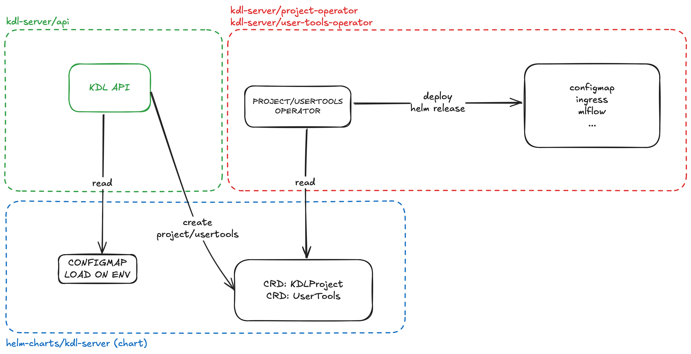

# KDL Server API operators architecture

## 1. KDL Server API

* Reads configuration from `ConfigMaps`
* Creates `KDLProject` and `UserTools` CRD manifests based on:
  * [`usertools.go`](https://github.com/konstellation-io/kdl-server/blob/main/app/api/infrastructure/k8s/usertools.go) structure
  * [`kdlproject.go`](https://github.com/konstellation-io/kdl-server/blob/main/app/api/infrastructure/k8s/kdlproject.go) structure

## 2. KDL operators

[Operator SDK](https://sdk.operatorframework.io/docs/building-operators/helm/) to create Kubernetes operators that manage custom resources through Helm releases. Exist two types:

* `Project Operator`
* `User Tools Operator`

These operators:

* Monitor and read CRD resources:
  * [`KDLProject`](https://github.com/konstellation-io/helm-charts/blob/main/charts/kdl-server/crds/project-operator-crd.yaml)
  * [`UserTools`](https://github.com/konstellation-io/helm-charts/blob/main/charts/kdl-server/crds/user-tools-operator-crd.yaml)
* Deploy Helm releases that create:
  * `configMaps`
  * `ingress`
  * `mlflow`
  * ... and other resources

## 3. Helm Charts operator

* Contains the base Helm chart configuration, all resources are defined on [`kdl-server`](https://github.com/konstellation-io/kdl-server/tree/main/) repository on:
  * [`project-operator`](https://github.com/konstellation-io/kdl-server/tree/main/project-operator/helm-charts/kdlproject)
  * [`user-tools-operator`](https://github.com/konstellation-io/kdl-server/tree/main/user-tools-operator/helm-charts/usertools)

## Workflow description

1. Configuration Loading
   * KDL API reads configuration from `configMaps`

2. Resource creation
   * KDL API creates `Project`/`UserTools` custom resources with `values` from `configMaps`
   * These are defined as `CRDs` in the Kubernetes cluster

3. Operator processing
   * `Project`/`UserTools` Operators detect new CRD instances
   * Operators read the `CRD` object

4. Resource deployment
   * Operators deploy Helm releases based on the `CRD` object
