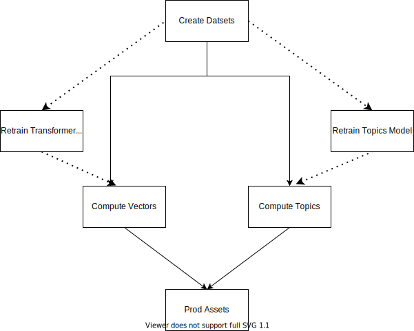

# Knowledge Galaxy gRPC server and data pipeline

## Project Structure

```bash
├── assets  # Output assets directory.
├── inputs  # Input datasets.
├── pipe    # Source folder for data/model generation.
├── proto   # Proto file schema definition.
├── scripts # Utility scripts for the project.
├── server # gRPC server code
│    ├── proto
│    └── tools
└── tests # Test for grpc server
    ├── integration
    └── unit
```
## Server
### Generate protobuf code
To generate the golang and python code you have to run the following script:
```bash
# from kg directory
bash scripts/generate_proto.sh
```

### Asset download
You have to install [dvc](https://dvc.org/doc/install)

After that you have to run the following command:
```
dvc pull
```

### Configuration
Most of the configuration is done through environment variables:
```bash
# Mandatory
KG_ASSET_ROUTE="/home/assets" # Asset route this is a mandatory variable

# Server Settings
KG_WORKERS=1 # Number of threads for the server defaults to 1
KG_HOST="localhost" # Address for the server defaults to localhost
KG_PORT=5555 # KG server port defaults to 5555

# Recommender Settings
KG_N_HITS=1000 # Number of outputs that the recommender outputs defaults to 1000

# Log file
KG_LOG_FILE="/var/log/kg.log" # Log file path defaults to /var/log/kg.log
KG_LOG_LEVEL="INFO" # Log level defaults to info
```

### Run server

Install the dependencies using `pipenv`:
```
pipenv install
```

and then run:
```
pipenv run python server/app.py
```

to run in minikube create dev environment:
```
kdlctl.sh dev
```

### Requests to the server
To use this examples you will have to install [grpcurl](https://github.com/fullstorydev/grpcurl)
```
grpcurl -import-path .. -proto knowledge_graph.proto \
 -plaintext -d '{"description": "test"}'\
 localhost:5555 kg.KGService.GetGraph
```

### Testing and linters

#### Unit tests

To run the unit tests you have to install the development dependencies:

```bash
pipenv install --dev
```

and then run:

```bash
pipenv run python -m pytest -m "not int"
```

#### Linting and Type Checking

To check the code quality run the following tools

```bash
# flake8 checks code conventions (pep8...) and code style, docs...
flake8

# mypy is not fully fuctional but it's useful, it simulates static typing
mypy [file-to-analyze]
```

#### Integration tests

To run the integration tests you have to set up a server:

```bash
pipenv run python server/app.py
```

and then run:

```bash
pipenv run python -m pytest int
```
### Caveats with PyTorch versions

The current installed version is a gpu+cpu version if you have any problems with your environment change the version
to cpu only.

## Data pipeline:

### Structure


### Run data/asset creation:
You have to install [dvc](https://dvc.org/doc/install) and then run to reproduce the full data pipeline:
```
dvc repro
```

The pipeline consists of the following steps:
```
check-inputs
create-dataset
compute-vectors
compute-topics
```

You can rerun an specific step with the following command:
```
dvc repro [step-name]
```


