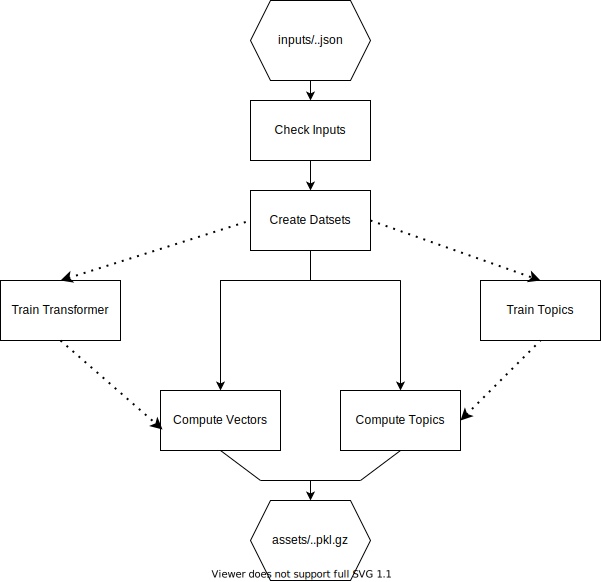

# Data pipeline:

## Structure


## Run data/asset creation
First you have to execute the download script to get the latest versions of the inputs:
```
pipenv run src/pipe/download_datasets.py
```

To run the entire dataset update dataset:
```
pipenv run dvc repro
```

The pipeline consists of the following steps:
```
check-inputs
create-dataset
train-transformer (freezed)
create-topic-labels (freezed)
train-topics (freezed)
compute-vectors
compute-topics
```

To unfreeze the training steps:
```
dvc unfreeze [training-step-name]
```
## Update and store data

Once you have run the pipeline you can commit your current data using:
```
dvc commit
```
This will commit in dvc the current version of output data.

After that you can store in an external storage (You have to ask the project admins permission to commit to this storage):
```
dvc push -r s3
```
Now you can version the dvc.lock file with git and push it to the remote repo:
```
git add dvc.lock
git commit ...
git push origin ...
```
After this you have to update ```Dockerfile``` variable ```ASSET_COMMIT``` with your last
commit hash.
